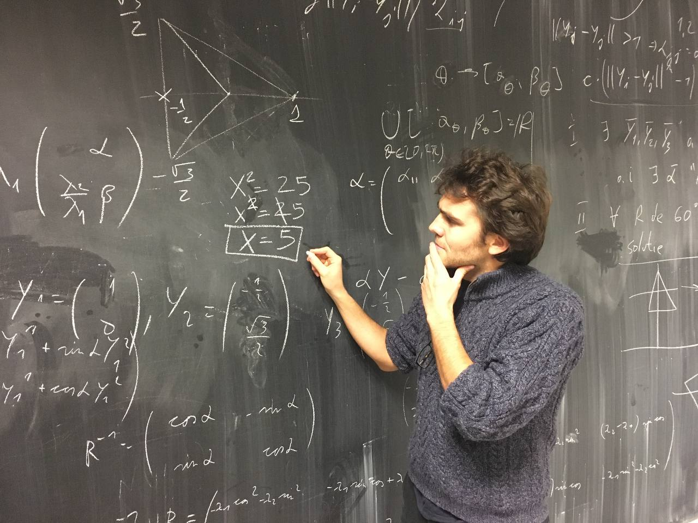

I am a young doctor in statistics. Really into Bayesian modeling and computational statistics, but also a curious person with a strong interest in health, ecology and social sciences. Learn more reading [my CV](https://github.com/SebastienCoube/SebastienCoube/blob/main/CV_S_COUBE_SISQUEILLE.pdf).

I strive to [fly less](https://sites.tufts.edu/flyingless/). 
